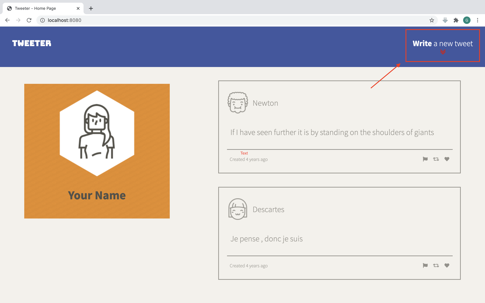
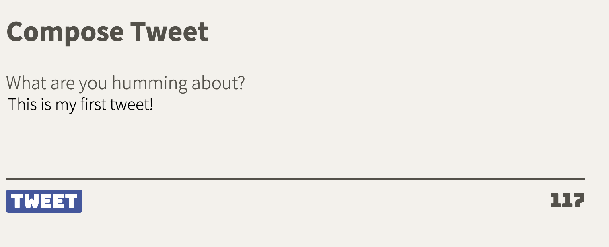
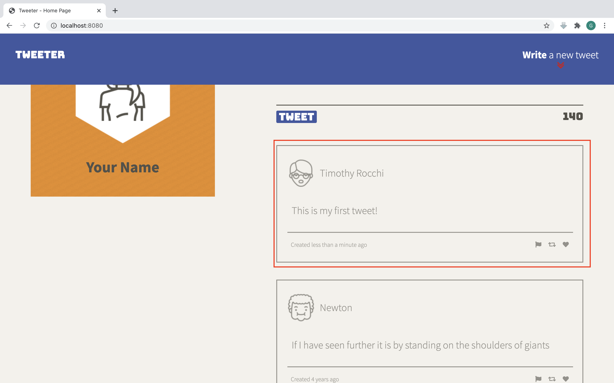

# Tweeter Project

This project is a simple AJAX-based Twitter clone that uses jQuery, HTML5 and CSS3.

## Final Product
Click on the icon on the right side of the navigation bar. It will open the tweet box.

Type in your tweet message, and press the TWEET button. There is a 140-character limit; the number of remaining characters is shown on the bottom right.

The newest tweet will be shown on top. The server will generate a random user profile.

## Getting Started
1. Install all dependencies (using the npm install command).
2. Run command: npm start local

## Dependencies

- body-parser
- express
- chance